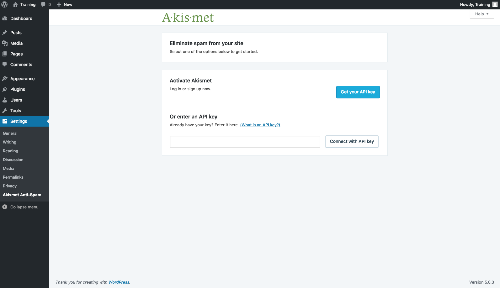
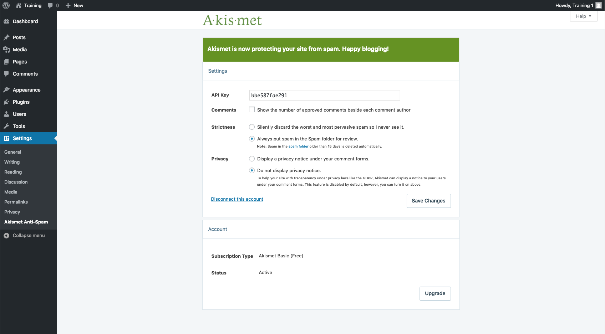

# Managing Spam On A Site

## Description

Learn why spam is a problem for all WordPress sites, why you should control it and learn tips to manage it.

## Prerequisite Skills

*   Understanding of installing and activating plug-ins on a self-hosted WordPress website.

## Objectives

*   Objectives should be worded as actions that the student can do once they’ve finished. See [Bloom's Taxonomy of Action Verbs](http://www.fresnostate.edu/academics/oie/documents/assesments/Blooms%20Level.pdf) (PDF) as a reference. Avoid using words like "know," "understand," "be introduced to," etc.

## Target Audience

Who is this lesson intended for? What interests/skills would they bring? Choose all that apply.

*  [x] Users
*  [ ] Designers
*  [ ] Developers
*  [ ] Speakers
*  [ ] All

## Experience Level

How much experience would a participant need to get the most from this lesson?

*  [x] Beginner
*  [ ] Intermediate
*  [ ] Advanced
*  [ ] Any

## Type of Instruction
What strategies will be used for this lesson plan? Choose all that apply.

*  [x] Demonstration
*  [ ] Discussion
*  [x] Exercises
*  [ ] Feedback
*  [x] Lecture (Presentation)
*  [ ] Show and Tell
*  [ ] Tutorial

## Time Estimate (Duration)

How long will it take to teach this lesson (in minutes)?

30 minutes

## Prerequisite Skills 
Partcipants will get the most from this lesson if they have familiarity with:

* Proficiency in searching for and installing plugins
* Proficiency in navigating through the WordPress Adminstration Panels

## Class Discussion

If you have an email address, I'm sure you have received email spam. Spam, otherwise known as an unsolicited commercial message, or something you never asked for, trying to sell you something you don't need, happens in WordPress too. Comment Spam happens when a spammer posts comments to your website. **Why would they do this?** Most spam comments contain links to the spammer's website, Their goal, is to increase the number of back-links to their website by publishing them anywhere and everywhere they can. The hope is that the higher number of backlinks, the higher their Google Page Rank will be. In reality, Google views these types of links as low-quality backlinks and they do not help spammers, and instead will sometimes hurt Page Rank. **Why does spam hurt your site?** These spam posts can make your website look less credible, include information that you don't want your readers to see and sometimes even cause problems with your website's SEO. **Controlling**** Spam with a Plugin: **All WordPress sites should utilize some type of anti-spam plugin. There are many different free and paid plug-ins that offer spam protection for your website.  Some of these plugins include [Akismet](https://make.wordpress.org/training/handbook/plugin-lessons/what-is-akismet/), Spam Plugin Lesson 2 and Spam Plugin Lesson 3.

## Exercises

**Managing Spam via the WordPress Admin Settings**

In addition to anti-spam plugins, WordPress has a number of built-in tools that can help control comment spam.

1.  In the WordPress Dashboard, go to Settings > Discussion. Within this page a number of different options can be turned on or off depending on your requirements.

* Allow link notiifcations from other blogs (pingbacks and trackbacks) on new articles - Pingbacks and Trackbacks are basically a method to notify other relevant blogs of new content that their readers may also be interested in. Although this can lead to your site generating some additional traffic, it does also lead to the possiblity of a lot more spam. If you are not concernd about Pingbacks or Trackbacks then you will be quite safe unchecking this.

* Allow people to post comments on new articles - unchecking this will remove the comments section from the bottom of any posts thereby in effect stopping any spam comments that could be posted. It does however of course mean that any geniune users are also unable to comment. 

* Comment author must fill out name and email - this forces anyone trying to post a comment to also provide their name and email when checked. This may help especially in the case of spam bots. 

* Users must be registered and logged in to comment - a particularly effective way to prevent spam comments is to only allow users who have registered to your site and provided a valid email address to post any comments. This may also however discourage any geniune users from commenting as they may not have the time or inclanation to sign up to your site just for the purposes of posted a quick messsage or comment.

* Automatically close comments on articles older than ..... days - you may find that your blog posts only receive geniune comments in the first few weeks of being posted and anything after that is irrelevant. To prevent spam being posted after this timeframe you could specificy a number of days at which point the post is then closed off for any comments. The previously supplied comments will of course still be avialable to read by your site visitors.

* Email me whenever anyone posts a comment - this setting will not necessarily stop any spam being posted to your site, however should this happen you will receive an email informing that you have received a comment. You would then be able to review this comment and should it be a spam comment you could delete it. This does however mean that if you have a particularly busy site receving many comments, you will also be receiving many emails!

* Before a comment appears comment must be manually approved - this is very similar to the previous option in that you will receive an email each time a comment is made. In this case however the comment will not appear to other readers on the site untill you log in and approve this. 

* Comment moderation - spam comments generally contain many links in this text. Therefore you can request WordPress to hold the comment in the moderation queue if a certain number are contained. The default is 2 however if you wish to be extra secure then you can change this down to one or even none. Any comments which are held for moderation will need to be checked and approved by you by logging into the WordPress Admin.

* You can also request WordPress to hold a comment for moderation if it contains any offensive words, names, emails etc. This will however require you to list these out in the large text field. 

* Comment Blacklist is very similar to the above setting however any comments found to contain these words will be immediately sent to the trash.

[QUESTION: looking at comment spam tools as mentioned here: https://codex.wordpress.org/Combating_Comment_Spam. Some of this is touched on in the Settings Lesson Plan, but not all. Should detailed notes be included in this LP, or edited into the sessions LP.]

**Managaing Spam using the Akismet Anti-Spam Plugin**

Akismet Anti-Spam is a popular WordPress plugin used on millions of websites. In order to use the Akisment plugin, you will first need sign up for the Akisment service using a WordPress.com account which in turn will provide you with an API key. It would be advisable to do this before installing and settin up the plugin. 

**Generate an API key••

1. Visit the UR https://akismet.com/wordpress/. You will be presented with a number of different plans, however for the purposes of this tutorial we will just be using the Personal option which will provide the neccessary spam protection that we are after.

NOTE - the Akisment Personal option is stricly not for commercial use. If you will be using the plugin on a site which is of any commercial nature, then you will need to purchase either the Plus or Commercial plan.

2. Complete the steps as requested on the Akisment site.You will then be provided with a API key, this is a unique key associated to your account which will allow the Akisment plugin which we are about to install to successfuly connect to your account.

**Installing and setting up the Akismnet plugin.

1. Install the Akisment Anti-Spam Plugin from the WordPress respository. Activate the plugin once installed. 
2. Select Settings in order to access the below screen.

3. Copy your API key and then select CONNECT WITH API KEY
4. Once connected you will then be presented with a small green header bar informing you that Akisment is now protecting your site from spam! You should not need to adjust any of the settings below this. 

## Quiz

**Why is spam bad for your site?**

1.  It shows content that you may not want your readers to see
2.  It looks unprofessional
3.  It could hurt your SEO
4.  All of the above

**Answer:** 4. All of the above

**How can you control spam on your site (choose as many as applicable)?**

1.  Install an anti-spam plugin
2.  Call your host and ask for the "no more spam" package
3.  Make adjustments to the Settings > Discussion panel
4.  All of the above

**Answer:** 1. Install an anti-spam plugin & 3. Make adjustments to the Settings > Discussion panel 

**An Akismnet/Wordpress.com account is required to set up the Akisment plugin on your site**

1.  True
2.  False

**Answer:** 1. True
